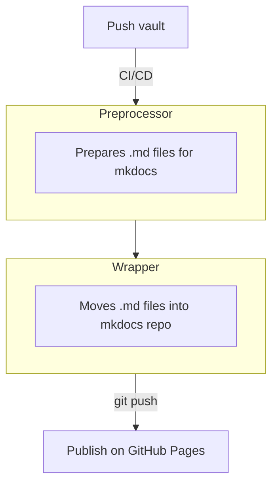

# Nether Portal
Deploy your obsidian vault using MkDocs.

## Project Structure

## Platform
Github actions

## Preprocessor
- preprocess PDFs
    - Add `Name (PDF).md` for every `Name.pdf`
- preprocess equations
    - remove whitespace
    - remove equation numbers
    - Add blank lines around every block
- preprocess admonitions (callouts)
    - Fix syntax
    - Map admonition type names
- preprocess file names
    - Add `# Filename` to the top of every file
- preprocess obsidian links
    - (low priority)

## Wrapper
- retrieve template mkdocs tree
- move preprocessed vault into `docs/`
- commit changes
- mkdocs gh-deploy (handled by pages repo)
